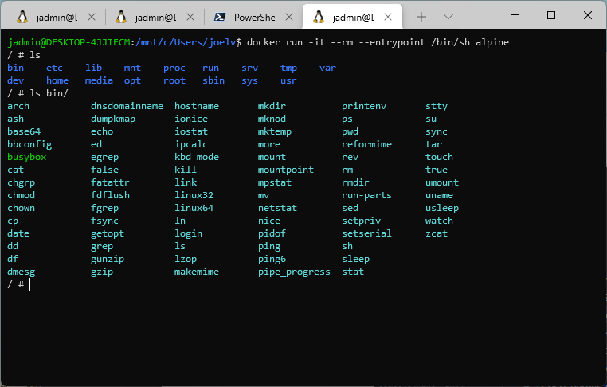
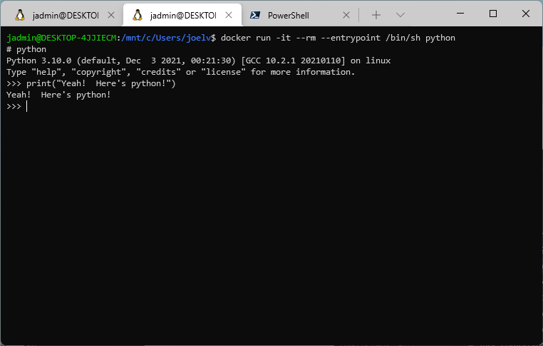
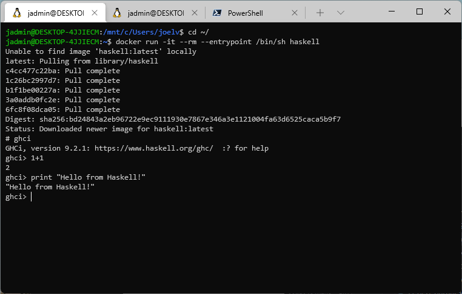
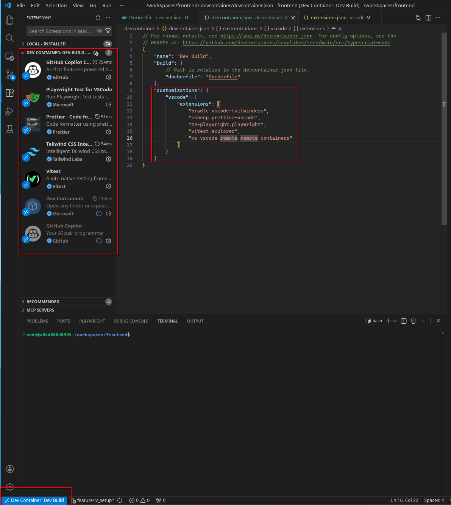

+++
title = "Dockerized Dev"
date = 2021-12-07
description = "Use dev containers to confine your toolchains."
slug = "2021-12-07-dockerized-dev"
taxonomies = { tags = ["DX", "Docker"] }
+++

## Docker Toolchains

I'm sure that you've heard of Docker, but have you considered running your development toolchains in Docker? 

Docker is great for containerizing your application tools that run in production, but it's also great at containerizing your development environment. Using docker during development allows more freedom to explore different languages and tech stacks without worrying about maintaining the tools on my system over time. When I'm done running a development container, I simply throw it away and spin it back up when I'm ready to get back at it.

First, let's lay down some useful `docker` commands to get you going:

> `docker run -it --rm --entrypoint /bin/bash $TOOL`

That command will drop you into an integrated terminal `-it`, remove it when you stop the container `--rm` and open the shell `--entrypoint /bin/sh`. The `$TOOL` can be any image on your system or on [Docker Hub](https://hub.docker.com/).

For example, you could spin up the `alpine` image with the `ash` shell:

> `docker run -it --rm --entrypoint /bin/ash alpine`



Or, I might spin up a `python` instance to take a look around Python.

> `docker run -it --rm --entrypoint /bin/sh python`



It's also great for other languages you might want to take out for a spin, such as:

> `docker run -it --rm --entrypoint /bin/sh haskell`



Pretty cool, eh?

## VSCode Dev Containers

The [Dev Containers VSCode Extension](https://containers.dev/) provides a great way to share an identical dev environment for a given repository. You can use the default images provided by Microsoft, or you can build your with a Dockerfile right there in your project!

### Example Setup

The following steps are useful for demonstrating using the dev containers with a NodeJS repository.

1. Create a `.devcontainer/` folder at the root of your repository.
2. Install the [Dev Containers VSCode Extension](https://containers.dev/).
3. Add the following `.devcontainer/devcontainer.json` file. Note the configuration can include other extension to be installed in the dev container.

```json
// For format details, see https://aka.ms/devcontainer.json. For config options, see the
// README at: https://github.com/devcontainers/templates/tree/main/src/typescript-node
{
    "name": "Dev Build",
    "build": {
        // Path is relative to the devcontainer.json file.
        "dockerfile": "Dockerfile"
    },
    "customizations": {
        "vscode": {
            "extensions": [
                "bradlc.vscode-tailwindcss",
                "esbenp.prettier-vscode",
                "ms-playwright.playwright",
                "vitest.explorer",
                "ms-vscode-remote.remote-containers"
            ]
        }
    }
}
```

4. Add the following `.devcontainer/Dockerfile`. Install any other tools as necessary.

```bash
# ref: https://hub.docker.com/_/node/
FROM node:24-trixie AS devcontainer

RUN apt-get update && apt-get install -y \
    curl \
    sudo \
    vim \
    && rm -rf /var/lib/apt/lists/*

USER node

WORKDIR /workspaces
```

5. Relaunch vscode in the devcontainer.
   - Options:
      1. Reload vscode & select "Reopen in Container" in the bottom right alert for the newly opened vscode.
      2. Run "Dev Containers: Rebuild and Reopen in Container" in the command pane in vscode.
      3. Select the remote action in the very bottom left of the vscode instance.
    

### Caveats

- Though [software rot](https://en.wikipedia.org/wiki/Software_rot) will likely one day render this dev container unusable, there is at least documentation of the full build process through the `./devcontainer/Dockerfile`.
  - A future developer could, therefore, create a new build process from the legacy build file.
- Switching dev containers across many repositories (30+) can be painful and slow.
- The file permissions can be tricky. Typically, with many Linux distros, such as [Debian Trixie](https://www.debian.org/releases/trixie/), the default user's id is `1000`. So, be careful to create/use a user with id 1000 to simplify `chown`ing with your host files that are volume mounted into your devcontainer.
    - If the docker image you are basing your devcontainer on does not have a user with id `1000` to use, then you will need to add one.
    - Fortunately, the `node` user in the `node:24-trixie` base image has id `1000`.
    - Technically, the id of the running user in the container just needs to match the user id on your host to avoid permission problems.
    - Note how my user on my host system, `joel`, is different than when mounted in through the dev container `node`:
    ```bash
    # From my host OS:
    joel@jarch ~/git/joelvandiver.github.io/blog (feature/jv_setup*)$ ls -al
    total 32
    drwxr-xr-x 7 joel joel 4096 Jan 24 11:58 .
    drwxr-xr-x 7 joel joel 4096 Jan 17 15:04 ..
    drwxr-xr-x 2 joel joel 4096 Jan 24 11:58 .devcontainer
    drwxr-xr-x 7 joel joel 4096 Jan 24 11:27 .git
    drwxr-xr-x 2 joel joel 4096 Jan 24 11:38 .github
    drwxr-xr-x 2 joel joel 4096 Jan 24 11:26 .vscode
    -rw-r--r-- 1 joel joel  150 Jan 24 11:26 README.md
    drwxr-xr-x 3 joel joel 4096 Jan 24 11:26 docs

    joel@jarch ~/git/joelvandiver.github.io/blog (feature/jv_setup*)$ id
    uid=1000(joel) gid=1000(joel) groups=1000(joel),957(docker),998(wheel)

    # From within the devcontainer:
    node@a54d80845994:/workspaces/frontend$ ls -al
    total 32
    drwxr-xr-x 7 node node 4096 Jan 24 17:58 .
    drwxr-xr-x 3 root root 4096 Jan 24 18:11 ..
    drwxr-xr-x 2 node node 4096 Jan 24 17:58 .devcontainer
    drwxr-xr-x 7 node node 4096 Jan 24 17:27 .git
    drwxr-xr-x 2 node node 4096 Jan 24 17:38 .github
    drwxr-xr-x 2 node node 4096 Jan 24 17:26 .vscode
    -rw-r--r-- 1 node node  150 Jan 24 17:26 README.md
    drwxr-xr-x 3 node node 4096 Jan 24 17:26 docs

    joel@jarch ~/git/joelvandiver.github.io/blog (feature/jv_setup*)$ id
    uid=1000(joel) gid=1000(joel) groups=1000(joel),957(docker),998(wheel)
    ```

- You can, if you prefer, install `git` within the devcontainer. However, beware of permissions issues to authenticate with the GitHub repos.
    - I usually prefer to just run git commands on my host OS's terminal.

## Update Log

> Update 2026-01

I have used VSCode Dev Containers for a few years now, but I thought I add it to this dockerized dev post!