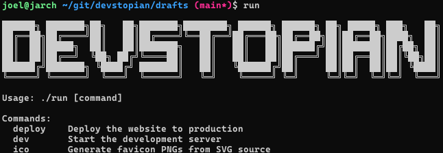
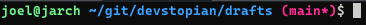

+++
title = "Run Script"
date = 2023-12-10
description = "Use a run script to streamline your development flow."
slug = "2023-12-10-run-script"
taxonomies = { tags = ["DX", "DevOps", "Bash"] }
+++

## Why `run`?

The `run` script was inspired by the `npm run` scripts.  I found the `npm` development flow transformative in how I think about organizing the automation my code repositories. Moving your development flow to a `run` script allows you to consolidate your scripts that you likely have scattered through your repo. Examples may include:

1. `scripts/install.sh`
2. `scripts/test.sh`
3. `build/deploy.sh`
4. etc.

Also, if you have many code repositories that you switch between, the `run` script gives you a consistent entry point to discover the tool available for developing that repository. I switch between ~10+ repos per day, and we have 150+ repositories at work.

## How to `run`?

### Add the Script

Setup a run script for quick development.

1. Create the run script file:

```bash
# Create the run file.
$ touch run
# Change the mode to executable.
$ chmod +x run
```

2. Add the run script from template:

```bash
#!/bin/bash

# Create a help doc to print usage.
help=$(cat << EOF

Usage: $0 [command]

Commands:
  install   Install the development tools.
  start     Run the application.
  test      Test the application.
EOF
)

cmd=$1

# Remove the first argument (shift left)
shift

# Switch on the commands to run.
case $cmd in
    "install")
        echo "TODO: Add [install]"
        # Use "$@" to pass all remaining arguments.
        ;;
    "start")
        echo "TODO: Add [start]"
        # Use "$@" to pass all remaining arguments.
        ;;
    "test")
        echo "TODO: Add [test]"
        # Use "$@" to pass all remaining arguments.
        ;;
    *)
        # Print the help doc.
        echo "$help"
        ;;
esac
```


## Example run:

The following is the `run` script for deploying this blog (*as of 2026-02-13*). For fun, I like to generate logos via an online text-to-ascii art generators, such as [https://patorjk.com/software/taag/](https://patorjk.com/software/taag/).

```bash
#!/bin/bash

# Reference https://patorjk.com/software/taag/

help=$(cat << EOF
                                                                                
Usage: $0 [command]

Commands:
  deploy    Deploy the website to production
  dev       Start the development server
  ico       Generate favicon PNGs from SVG source
EOF
)

deploy() {
    # Only commit and push to the draft repository if a commit message
    # was provided after the command
    if [ -n "$2" ]; then
        echo "Committing changes with message to drafts: $2"
        git add -A
        git commit -m "$2"
        git push origin main
    fi

    echo "Deploying to production..."
    msg=${2:-"Deploying to production"}
    zola build

    cd ../blog    
    rm -rf \
        404.html \
        atom.xml \
        blog \
        favicon.ico \
        favicon.png \
        favicon.svg \
        images \
        index.html \
        regular-page \
        robots.txt \
        sitemap.xml \
        style.css \
        tags

    cp -r ../drafts/public/* ./

    # Commit and push the changes to the production repository
    git add -A
    git commit -m "$msg"
    git push origin main
}

case $1 in
    deploy) deploy "$@" ;;
    dev) zola serve --open ;;
    ico)
        inkscape ./static/favicon.svg --export-type=png --export-width=32 --export-height=32 --export-filename=./static/favicon.png
        mv ./static/favicon.png ./static/favicon.ico
        ;;
    *) echo "$help" ;;
esac
```

> Runtime:



## Optional Optimizations

1. Add the Current Directory to `$PATH`.

To avoid the need to type `./run` every time you run the script, you could add the current directory to your `$PATH`. This allows for running any script in your current directory without the prefixed `./`, (e.g. `run`). This isn't strictly required, but it certainly helps to trim the 2 characters in a command you may run hundreds of a times in a day. Keep in mind though, that bash will start its search for any command you type with your current directory!

```bash
# Add to `~/.bashrc`
export PATH="$PATH:."
```

2. Update your prompt string (`$PS1`) in your bash environment.

The prompt string sets the text with colors when you open your terminal:



I personally like to have the git branch printed along with whether the current repository has any outstanding changes (aka \**dirty*). You can add the following to your `~/.bashrc` to get the same effect in your terminal.

```bash
git_branch() {
  local branch dirty

  # Get branch name
  branch=$(git symbolic-ref --short HEAD 2>/dev/null) || return

  # Check for dirty state
  if ! git diff --quiet 2>/dev/null || ! git diff --cached --quiet 2>/dev/null; then
    dirty="*"
  elif [ -n "$(git ls-files --others --exclude-standard 2>/dev/null)" ]; then
    dirty="*"
  fi

  printf "%s%s" "$branch" "$dirty"
}

# red:   #ff2d6f  (255,45,111)
# green: #6ef08b  (110,240,139)
# yellow:#ffd166  (255,209,102)
# blue:  #3aa3ff  (58,163,255)
# magenta:#ff2d95 (255,45,149)
# cyan:  #00f0d7  (0,240,215)
RED="\[\033[38;2;255;45;111m\]"
GREEN="\[\033[38;2;110;240;139m\]"
YELLOW="\[\033[38;2;255;209;102m\]"
BLUE="\[\033[38;2;58;163;255m\]"
PURPLE="\[\033[38;2;255;45;149m\]"
CYAN="\[\033[38;2;0;240;215m\]"
RESET="\[\033[0m\]"

PS1="${GREEN}\u@\h${RESET} ${BLUE}\w${RESET} ${PURPLE}(\$(git_branch))${RESET}\\$ "
```

Happy `run`ing!

## Update Log

> Update 2026-02-13

My original post from 2023-12-10 had a run script example from my blob build at time using the [Material for MkDocs](https://squidfunk.github.io/mkdocs-material/) from the python community. Also, I added the `$PS1` optional enhancement as this has significantly improved my dev-flow while switching repositories.