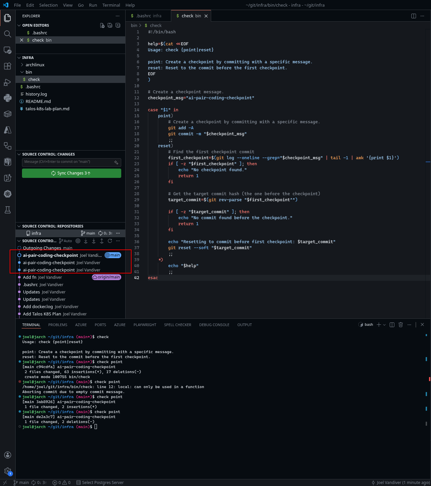
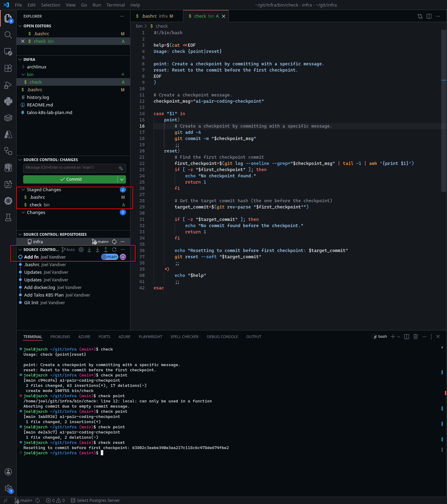

+++
title = "Agentic GitFlow"
date = 2026-02-14
description = "Take control of your agent's changes!"
slug = "2026-02-14-agentic-gitflow"
taxonomies = { tags = [] }
+++

Wow, agentic AI is crazy! The rate of its changes is staggering. With its help, tasks that used to take me hours or days now take me a few seconds or minutes. However, learning to use agentic AI rigorously is a skill that requires discipline, reflection, and trial and error. 

A while ago, I chose to use an AI agent to help me in an unfamiliar problem space and to experiment with how far I could push that agent beyond my understanding. I gave it a few prompts. It made lots of changes. I made a few more prompts. It made more changes. The result was a lot of slop. Given my lack of understanding of the problem, I wasn't sure how much of the slop was a result of my misunderstanding and poorly written prompts or the agent's lack of training. I did know that all code, whether written by human or agent, should be:

1. easy to read,
2. performant,
3. secure,
4. testable, 
5. idiomatic
6. ...

That's when I realized that I needed to take more control of the flow of changes. I needed to press into all of the changes to make sure that I understood. I needed to prompt it to refactor the code to make it more legible and to follow good engineering practices. If subsequent prompts and changes did not add clarity, then I needed a way to easily set those changes aside or throw them away forever.

The pull-request and reset-rebase flows from my post on [gitflows](@/blog/2021-06-08-git-flow/index.md) are great when I'm making the changes that I want to share with my team, but what about when there was an agent wreaking havoc on my repo? I didn't want to push changes from the agent that weren't fully vetted. I wanted to use an agent to accelerate my rigor and my understanding, not produce slop.

So, I came up with this custom flow specifically to work with agents:

1. Prompt for changes.
2. Reject changes I do not approve of.
3. Create a checkpoint commit as I have verified progress was made.
4. Prompt for a refactor.
5. Iterate until the solution is **correct**.
6. Reset the checkpoint commits with the final changes still outstanding.
7. Create an official commit.
8. Follow one of the [gitflows](@/blog/2021-06-08-git-flow/index.md) accordingly.

This flow modifies the reset-rebase flow from [gitflows](@/blog/2021-06-08-git-flow/index.md) by adding a specific checkpoint message, `"ai-pair-coding-checkpoint"`. The flow helps me to steer the agent to produce a **correct** solution. I can also more freely change my mind on requirements or unravel my mistaken prompts by throwing away changes with `git reset --hard $last_good_commit`.

To improve my efficiency, I added this `check` script to my `$PATH`:

```bash
#!/bin/bash

help=$(cat <<EOF
Usage: check {point|reset}

point: Create a checkpoint by committing with a specific message.
reset: Reset to the commit before the first checkpoint.
EOF
)

# Create a checkpoint message.
checkpoint_msg="ai-pair-coding-checkpoint"

case "$1" in
    point)
        # Create a checkpoint by committing with a specific message.
        git add -A
        git commit -m "$checkpoint_msg"
        ;;
    reset)
        # Find the first checkpoint commit
        first_checkpoint=$(git log --oneline --grep="$checkpoint_msg" | tail -1 | awk '{print $1}')
        if [ -z "$first_checkpoint" ]; then
            echo "No checkpoint found."
            return 1
        fi

        # Get the target commit hash (the one before the checkpoint)
        target_commit=$(git rev-parse "$first_checkpoint^")

        if [ -z "$target_commit" ]; then
            echo "No commit found before the checkpoint."
            return 1
        fi

        echo "Resetting to commit before first checkpoint: $target_commit"
        git reset --soft "$target_commit"
        ;;
    *)
        echo "$help"
        ;;
esac
```

### Example Agent Check Flow

As the agent makes progress I run several `check point` commands. You can see the multiple `ai-pair-coding-checkpoint` commits in the screenshot.



Then, once I'm satisfied with the final changes, I run `check reset`. The screenshot shows commits have been reset and the final changes left in the queue.



Now, I'm free to create the final commit with the verified changes.

## Watch Out!

If you add other commits after a `check point` without a `check reset`, the script above will reset to the first `ai-pair-coding-checkpoint` it finds. 

If you pushed the commits to the remote, then you will need to do some cleanup:

```bash
# Find the commit you want to reset 
# even though you reset to before it.
git log --all

# Reset to that commit
git reset --soft $commit_hash

# Find the ai-pair-coding-checkpoint commit hash 
# to reword.
git log

# Rebase that commit interactively.
# Change "pick" to "reword" and save.
git rebase -i $commit_hash

# Force push to the remote, only if
#   you have permission to force push!
git push -f
```
