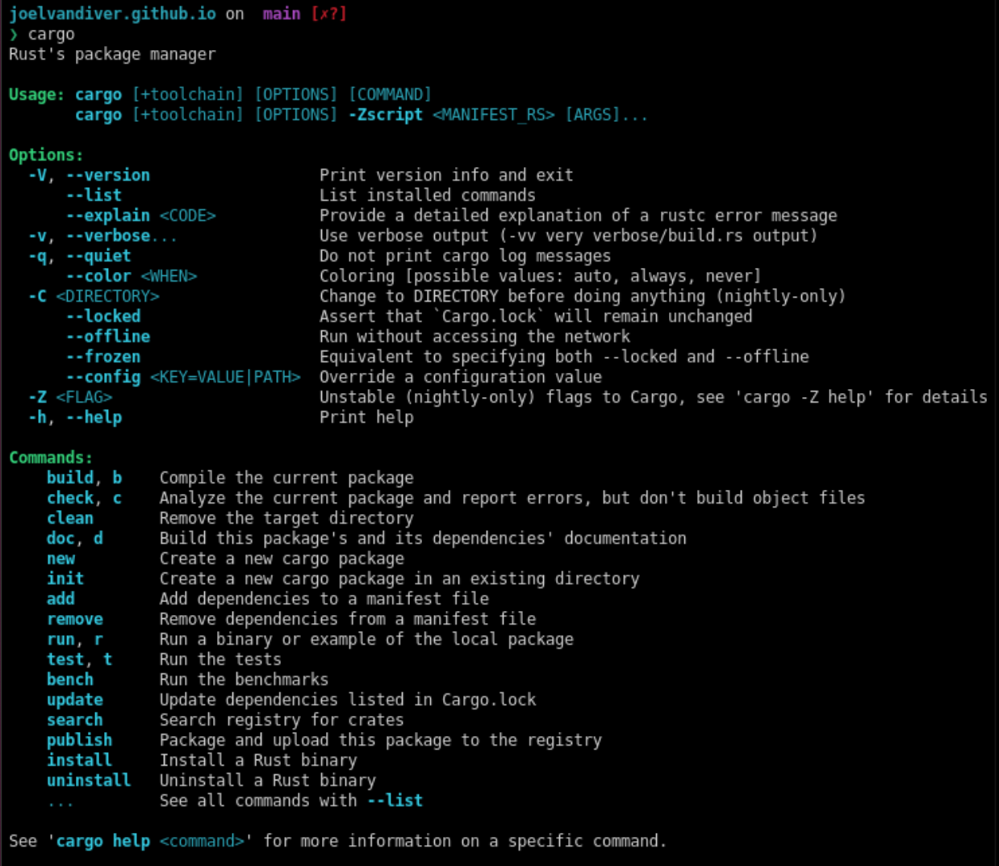

+++
title = "Install Tools"
description = "Let's get the tools!"
taxonomies = { tags = [] }
+++

For people completely new to programming, installing the necessary tools is one of the hardest things to learn. [*If you are running Windows, I highly advice that you install [WSL](https://learn.microsoft.com/en-us/windows/wsl/install).*] I will be assuming that you will be working in a [bash](https://www.gnu.org/software/bash/) terminal.

Head over to [Install Rust](https://rust-lang.org/tools/install/) and see if you can get your installation up and running. If your installation is good, you can run [`cargo`](https://github.com/rust-lang/cargo) in the terminal of your choice. You should see something similar to:

## Definitions

1. **cargo**: Rust's package manager and build tool
2. **terminal**: The application to run commands on your computer
3. **bash**: The default shell in many terminals
4. **shell**: A command-line interpreter

## Help!

If you're running into trouble, then I'd suggest heading over to your favor AI chatbot and describe your problem and your environment.

Also, feel free to raise an [issue for me](https://github.com/joelvandiver/joelvandiver.github.io/issues)!
